# Restaurant Order Management System (WinForms C#) 🍽️


  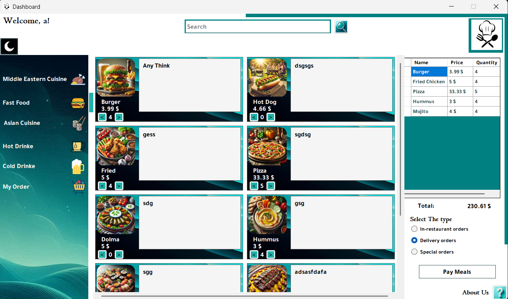


  ## Overview  
A Windows Forms application in C# re-implementing a demanding **Programming 3 (Java)** course project from **Damascus University**, developed during my first year of ITE at SVU.  
This project demonstrates my ability to apply **OOP concepts**, build **GUIs**, and handle **Files I/O**.  

## Features  
- Manage restaurant menu items (add, edit, delete).  
- Place and track customer orders.  
- Monitor order status (pending, preparing, completed).  
- Generate simple daily reports.  
- User-friendly Windows Forms interface.  
- **Supports both Arabic and English languages** for a wider usability experience.  

## Requirements
- **IDE:** Visual Studio 2019 or newer.
- **Framework:** .NET Framework 4.7.2 or newer.
- **Language:** C# on Windows.
- **Database:** Non-relational (plain text files).

## Installation & Running
1. Clone the repository:
   ```bash
   git clone https://github.com/MuaazHbobati/Restaurant-Order-Management-System-CSharp.git

2. Open `Restaurant Order Management System.sln` in Visual Studio.

3. Build the solution (`Ctrl+Shift+B`).  

4. Run the project (`F5`).  

---
## Screenshots

### 🔑 Login
- **Arabic Login:**  
  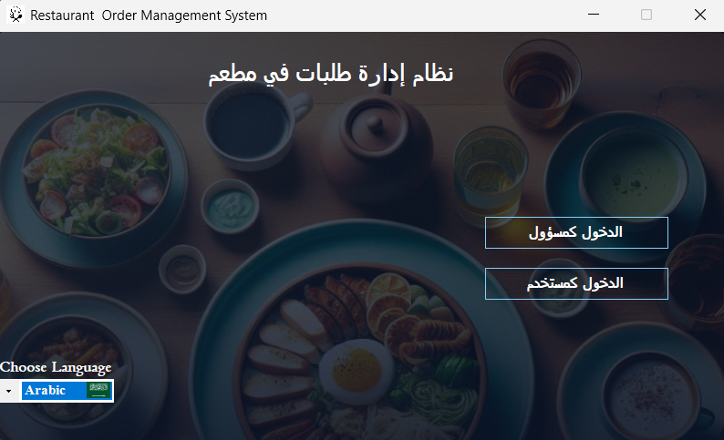
- **English Login:**  
  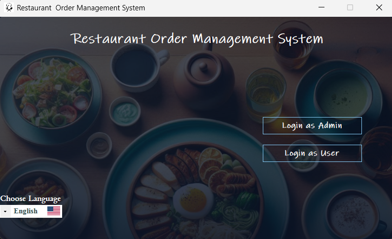

---

### 📊 Dashboard (User)
- **Arabic Light Mode:**  
  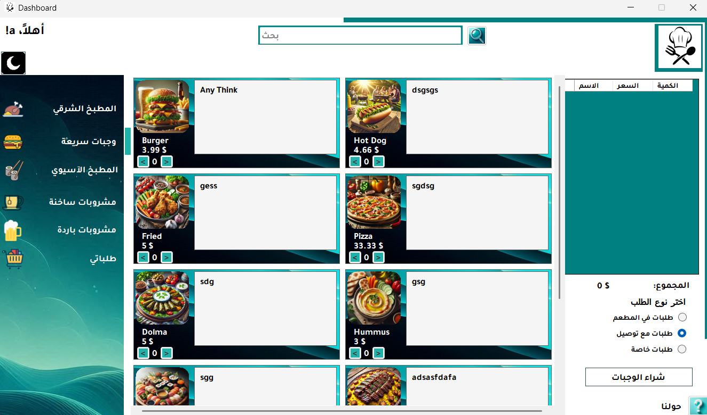
- **Arabic Dark Mode:**  
  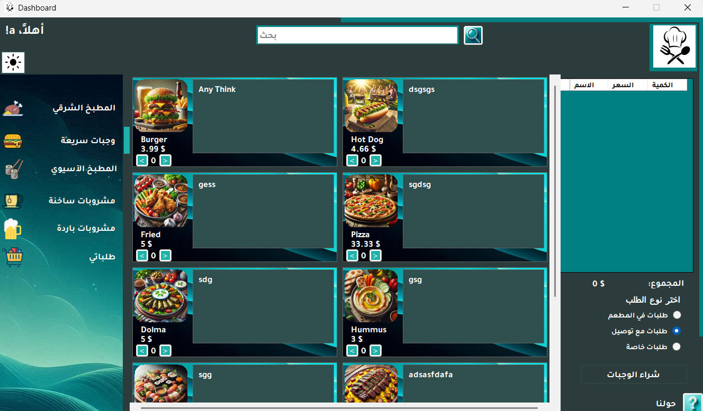
- **English Light Mode:**  
  
- **English Dark Mode:**  
  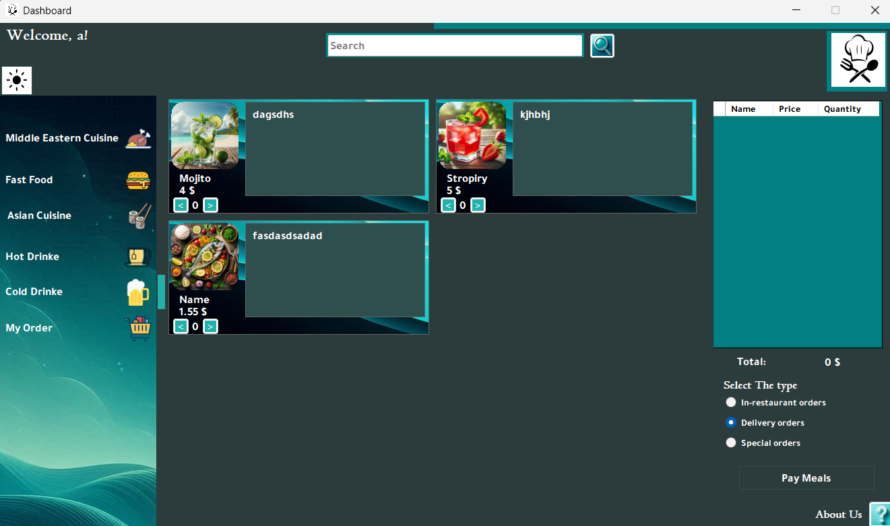

---

### 🛠️ Dashboard (Admin)
- **English Light Mode:**  
  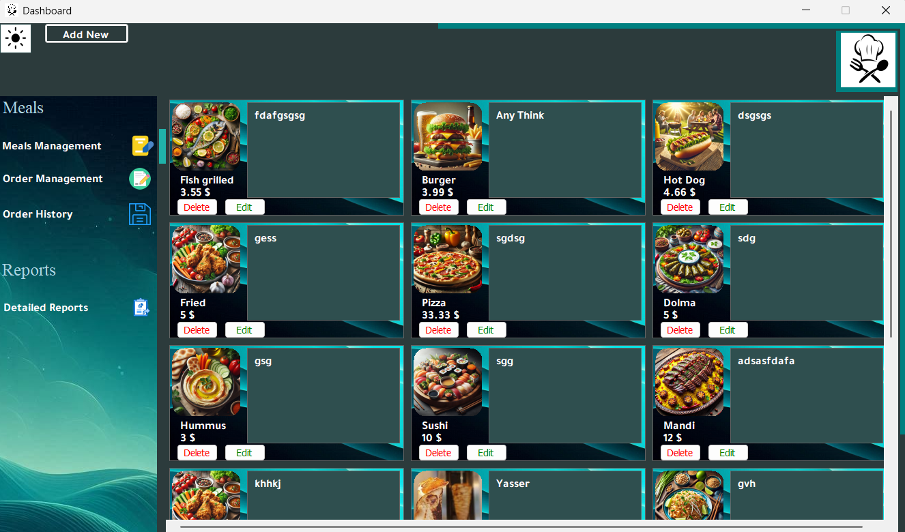
- **English Dark Mode:**  
  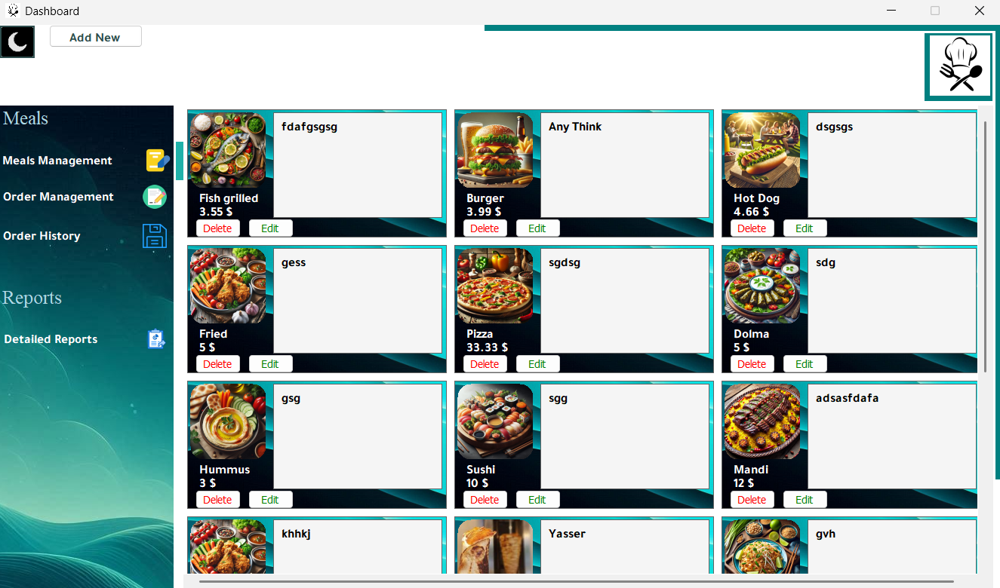

---

### 📂 Data & Records
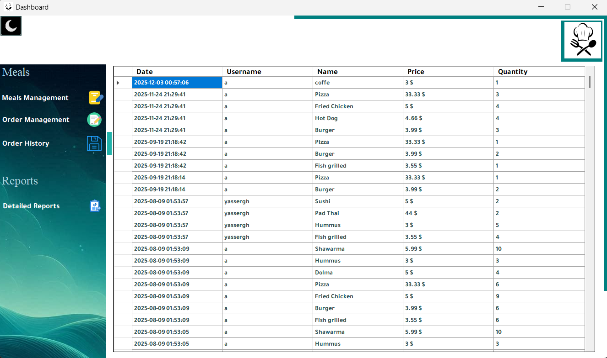

---

### 📑 Reports
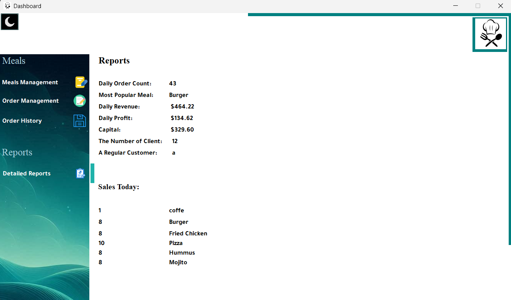

---

### 💳 Payment Form
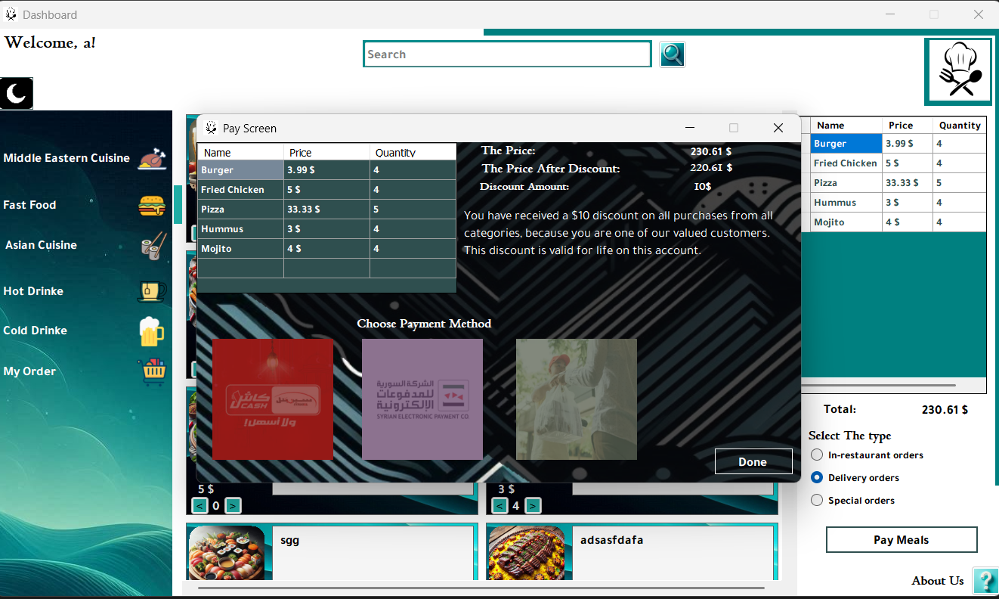

---

### ✅ Payment Process
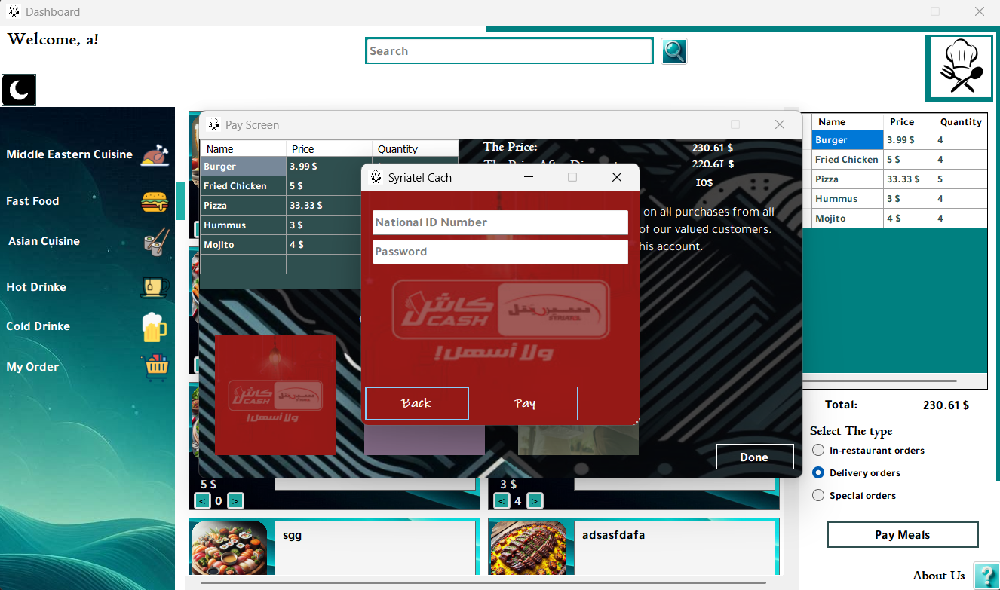
---

## Usage
- Add menu items via the menu management form.
- Place orders by selecting items and confirming.
- Track orders in real time.
- Generate daily reports.

---

## Project Structure
- **Solution:** `Restaurant Order Management System.sln`
- **Source:** Forms, logic, and resources
- **Database:** Non-relational (plain text files).
- **Docs:** Place screenshots under `docs/images/`

---

## By Mohammad Muaaz Hbobati </>

---
